<style>
@import url('https://fonts.googleapis.com/css2?family=Roboto+Condensed:wght@300&family=Spectral:wght@300&display=swap');

section {
  padding: 40px;
  font-family: 'Roboto Condensed', sans-serif;
  color: #fff;
  background: #000;
}

h1 {
  font-family: 'Spectral', serif;
  font-size: 60px;
  color: #fff;
}

h2 {
  font-family: 'Spectral', serif;
  color: #fffb;
}

/*
 * Synthwave '84 Theme originally by Robb Owen [@Robb0wen] for Visual Studio Code
 * Demo: https://marc.dev/demo/prism-synthwave84
 *
 * Ported for PrismJS by Marc Backes [@themarcba]
 */

code,
pre {
  color: #f92aad;
  font-family: Consolas, monospace;
  text-align: left;
  white-space: pre;
  word-spacing: normal;
  word-break: normal;
  word-wrap: normal;
  line-height: 1.5;
  background: #181818;
  border: none;
  border-radius: 8px;
  color: #fff;
}
pre > code[class="language-python"] {
  color: #fff;
  text-shadow: 0 0 2px #fff4, 0 0 16px #fff4, 0 0 10px #fff4, 0 0 2px #fff4;
}
pre > code[class="language-diff"] {
  color: white;
  text-shadow: none;
}
pre {
  padding: 1em;
  margin: 0.5em 0;
  overflow: auto;
}

.hljs-comment,
.hljs-block-comment,
.hljs-prolog,
.hljs-doctype,
.hljs-cdata {
  color: #9963ff99;
  text-shadow: 0 0 2px #001716, 0 0 5px #03edf933, 0 0 10px #ffff6633;
}

.hljs-punctuation {
  color: #ccc;
}

.hljs-tag,
.hljs-attr-name,
.hljs-namespace,
.hljs-number,
.hljs-unit,
.hljs-hexcode {
  color: #ffcc00;
  text-shadow: 0 0 2px #100c0f, 0 0 3px #ffaa0099, 0 0 5px #ffaa0099, 0 0 10px #ffaa0099;
}

.hljs-property,
.hljs-selector {
  color: #72f1b8;
  text-shadow: 0 0 2px #100c0f, 0 0 10px #257c5575, 0 0 35px #21272475;
}

.hljs-boolean,
.hljs-function,
.hljs-title,
.hljs-params {
  color: #fdfdfd;
}

.hljs-keyword {
      color: #ffcc00;
    text-shadow: 0 0 2px #100c0f, 0 0 3px #ffaa0099, 0 0 5px #ffaa0099, 0 0 10px #ffaa0099;
}

.hljs-string,
.hljs-char,
.hljs-attr-value,
.hljs-regex,
.hljs-variable {
  color: #9963ff;
  text-shadow: none;
}

.hljs-addition,
.hljs-deletion {
  background: #0f02;
  display: inline-block;
  color: white;
  text-shadow: none;
  margin-left: -1ch;
}
.hljs-deletion {
  background: #f002;
}
/**/
ol > li:not(:last-child) {
  opacity: 0.5;
}
</style>

# Forme plastikk i det fysiske 3D-univers 🖨️🗿
## Niklas M. Hole
### 24. Mars 2021

---

# 5 grunner til å forme plastikk? 🖐️

---
<!-- header: 5 grunner til å forme plastikk? 🖐️ -->

1. Kan lage kul kunst


---

1. Kan lage kul kunst
2. Lage noe praktisk


---

1. Kan lage kul kunst
2. Lage noe praktisk
3. Det er solid og lett


---

1. Kan lage kul kunst
2. Lage noe praktisk
3. Det er solid og lett
4. Lage komplekse former


---

1. Kan lage kul kunst
2. Lage noe praktisk
3. Det er solid og lett
4. Lage komplekse former
5. Det kan forbedre liv på mange måter


---
<!-- header: '' -->

# Hvorfor bruke plastikk? 🤔

- ... alle de forrige grunnene
- Det er billig! 🤑
- Går raskt 🚀

---
<!-- header: '' -->

# Så... hvordan former man plastikk? 🧱 ➔ 🗿

---
<!-- header: Så... hvordan former man plastikk? 🧱 ➔ 🗿 -->

1. Varme den opp (over 200 grader 🔥🔥🔥)


---

1. Varme den opp (over 200 grader 🔥🔥🔥)
2. Forme den


---
<!-- header: Så... hvordan former man plastikk? 🧱 ➔ 🗿 -->

1. Varme den opp (over 200 grader 🔥🔥🔥)
2. Forme den
3. Kjøle den ned


---
<!-- header: Så... hvordan former man plastikk? 🧱 ➔ 🗿 -->

1. Varme den opp (over 200 grader 🔥🔥🔥)
2. Forme den
3. Kjøle den ned
4. Profit!


---
<!-- header: '' -->

## "Men Niklas... hvordan gjør vi alt dette her? Jeg har jo ikke disse verktøyene hjemme?!"

---

# Vi har 3D-printere!

Det finnes flere måter å forme plastikk på, men dette er dagens billigste og kjappeste


---

# La oss se på noen typer 3D-printere

---
<!-- header: La oss se på noen typer -->

## De kommer i forskjellig prisklasser

- De dyre brukes gjerne i industri
- De de billige er ofte til privat bruk

---

## Lavere pris = noe er forenklet

Tips:
- Få en feeling på prisene
- Se reviews på YouTube! 📺
  - Gjerne de som har testet printeren over flere år
- Les større tester ✔️
- 3D-printere som selges i Norge er ofte trygge
  - Men det er mindre utvalg 😑

---

# Gjett pris!


---

# Gjett pris!

## 970kr (Banggood)

- Printer veldig tregt
- Ikke trygg! (kan faktisk brenne)
- Kan ikke printe komplekse former
- Lite printevolum


---

# Gjett pris!


---

# Gjett pris!

## 10 040 kr (Proshop, CDON)

- Faktisk OK pris
- Fordi du får:
  - Kan printe det meste
  - Innebygd sikkerhet
  - Kamera
  - Filtrerer luftpartikler
  - Stort printevolum
  - Bedre detaljer
  - Styres over WiFi
  - 2 farger samtidig 🤯


---

# Gjett pris!


---

# Gjett pris!

## 27 388 kr (Dustin)

- Kanskje litt dyr 😅💸
- Mye av det samme som forrige
- Men det er ofte dette som koster øker prisen ytterligere:
  - Kjappere print
  - Enda bedre detaljer


---

# Gjett pris!


---

# Gjett pris!

## 4 345 kr (Proshop, Dustin, Clas Ohlson Soliden)

- Kan anbefales!
- Har faktisk akkurat det samme som de dyre, men:
  - Er mindre detaljert (men bra nok!)
  - Ikke like kjapp (men kjapp nok!)
- Har hatt den selv i et halvt år uten et eneste problem!


---
<!-- header: '' -->
# Finnes flere måter å 3D-printe på


---
<!-- header: Finnes flere måter å printe på -->

1. Lagvis med myk plast fra en "nozzle" (slik som vi har sett på)


---

1. Lagvis med myk plast fra en "nozzle" (slik som vi har sett på)
2. Lagvis med flytende stoff og en laser


---

1. Lagvis med myk plast fra en "nozzle" (slik som vi har sett på)
2. Lagvis med flytende stoff og en laser
3. Lagvis fylle en blokk med "sand" og stivne av deler mens man legger hvert lag


---

1. Lagvis med myk plast fra en "nozzle" (slik som vi har sett på)
2. Lagvis med flytende stoff og en laser
3. Lagvis fylle en blokk med "sand" og stivne av deler mens man legger hvert lag
4. Bruke lasere til å stivne deler i veskeform (eksperimentell)


---
<!-- header: '' -->
# Okey, det er nok nå, Niklas. Nå vil vi lage noe snart!

---

# [Pause!?](https://tv.nrk.no/program/FRED72000472) 🐟

---

# [5 tips før vi starter med modellering](https://www.youtube.com/watch?v=QdvSzXByi_g&ab_channel=TeachingTech) 📽️🍿

---

# Lurt å planlegge på forhånd

- Ta mål
- Lag skisser
- Kanskje lag enkle papirmodeller eller leiremodeller

---

# Men det er gøyere å hoppe rett i det!

Så la oss laste ned noen programmer og hacke litt

---

# Gratis verktøy for å lage modeller

# Tinkercad.com

# SketchUp.com

# OpenSCAD.org 👨‍💻

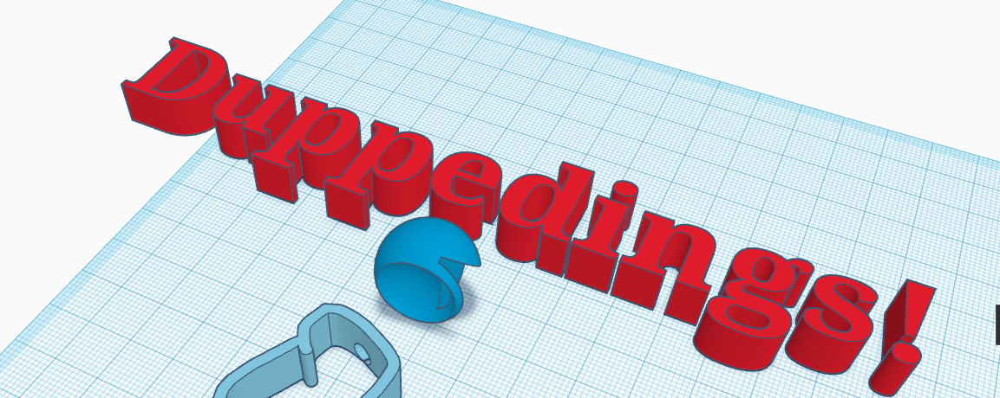

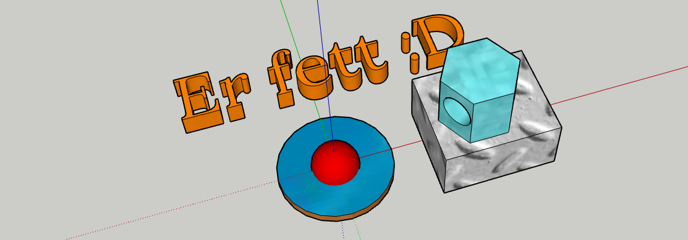


---
<!-- header: Gratis verktøy for å lage modeller -->
# Tinkercad

- Enkelt å tenke med (krever mindre planlegging)
- Men vanskelig å være presis

---

# Tinkercad

## La oss prøve litt!

Gå til https://tinkercad.com

---

## Lag denne

Gå til https://tinkercad.com

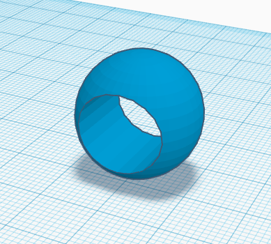

---

# SketchUp

- OK å tenke/leke med (krever mer planlegging)
- Laget for å være presis

---

# SketchUp

## La oss prøve oss litt her og!

Gå til https://app.sketchup.com

---

## Lag denne

Gå til https://app.sketchup.com

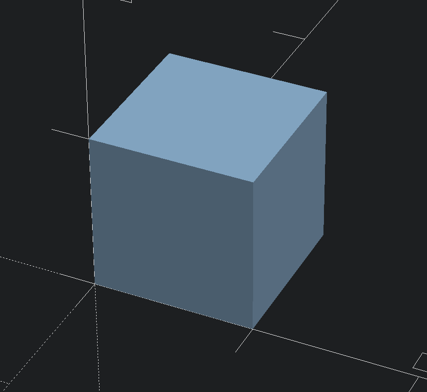

---

# OpenSCAD (med Python!)

- Ikke enkel å leke med (krever masse planlegging)
- Men lett å være presis
- Og man kan bruke programmering!
  - Variabler
  - Funksjoner / Matematikk
  - Løkker

---

# OpenSCAD (med Python!)

## Vi skal jobbe litt ekstra med denne

- Last ned OpenSCAD fra https://www.openscad.org
- Installere Python
- Installere `solidpython` og `openpyscad`
  - Noe ala: `$ pip3 install solidpython openpyscad`
- Installere `nodemon`
  - Noe ala: `$ sudo npm i -g nodemon`

---

<style scoped>
  ol > li {
    opacity: 1 !important;
  }
</style>

# OpenSCAD (med Python!)

1. Åpne kodeeditor
2. Lag en Python fil: `main.py`
3. Skriv inn denne koden:
   ```python
   from solid import *
   from solid.utils import *

   model = cube(10)

   scad_render_to_file(model, 'model.scad')
   ```
4. Kjør koden med `$ nodemon main.py`
5. Åpne `model.scad` med OpenSCAD


---
<!-- header: OpenSCAD (med Python!) -->

## Start med en 10x10x10 blokk (cube)

```python
from solid import *
from solid.utils import *

model = cube(10) # x, y, z

scad_render_to_file(model, 'model.scad')
```


---

## Vi kan bruke logikk

```diff
from solid import *
from solid.utils import *

model = cube(10)
+model -= cube(5)

scad_render_to_file(model, 'model.scad')
```

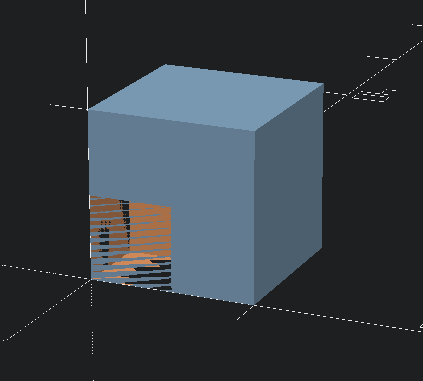

---

## Hva skjedde nå?

```diff
from solid import *
from solid.utils import *

model = cube(10)
+model -= cube(5)

scad_render_to_file(model, 'model.scad')
```


---

## Z-fighting!

Det går bra for 3D-printing, men om du vil fikse det må du endre verdiene bittelitt

```diff
from solid import *
from solid.utils import *

+zf = 0.01
model = cube(10)
+model -= translate([-zf, -zf, -zf])(
  cube(5)
+)

scad_render_to_file(model, 'model.scad')
```


---

## Flytte objekter

Bruk `translate([x, y, z])(model)`

```diff
from solid import *
from solid.utils import *

model = cube(10)
+model -= translate([6, 6, 6])(
  cube(5)
)

scad_render_to_file(model, 'model.scad')
```

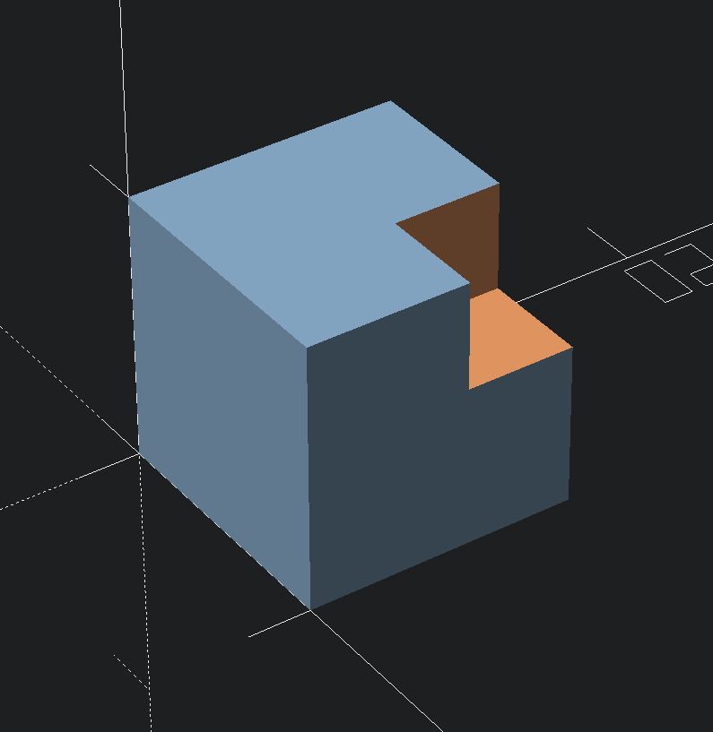

---

## Utfording: Lag denne

Bruk `translate([x, y, z])(model)`

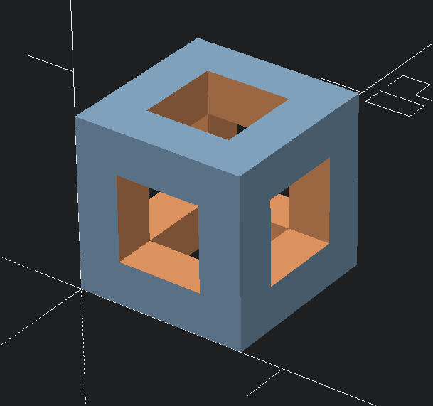

---

## Utfording: Lag denne

LF:

```python
from solid import *
from solid.utils import *

model = cube(8)
model -= translate([4, 2, 2])(cube(4.01))
model -= translate([2, 4, 2])(cube(4.01))
model -= translate([2, 2, 4])(cube(4.01))
model -= translate([-0.01, 2, 2])(cube(4))
model -= translate([2, -0.01, 2])(cube(4))
model -= translate([2, 2, -0.01])(cube(4))

scad_render_to_file(model, 'model.scad')
```


---

## Skalere objekter

Bruk `scale([x, y, z])(model)`

```diff
from solid import *
from solid.utils import *

+model = scale([10, 10, 10])(
    cube(10)
)

scad_render_to_file(model, 'model.scad')
```

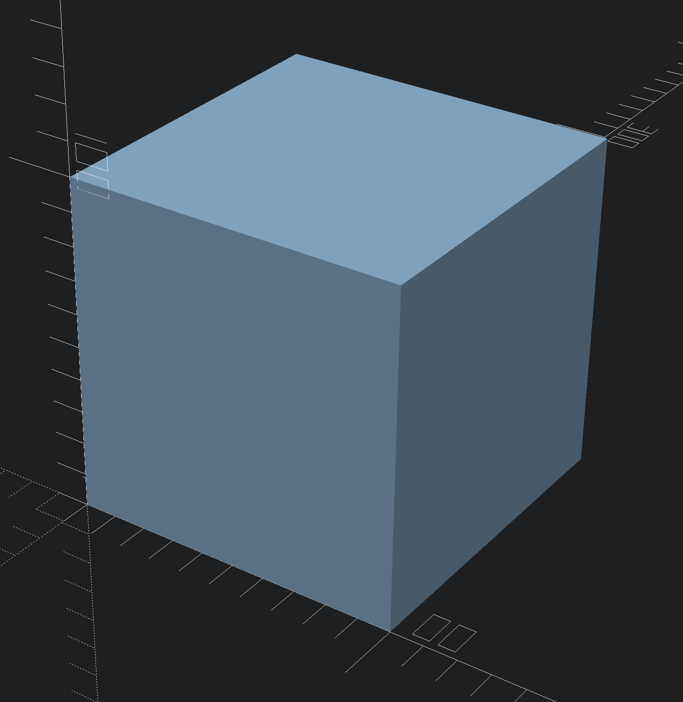

---

## Rotere objekter

Bruk `rotate([x, y, z])(model)`

```diff
from solid import *
from solid.utils import *

+model = rotate([0, 0, 30])(
    cube(10)
+)
model -= translate([6, 6, 6])(
  cube(5)
)

scad_render_to_file(model, 'model.scad')
```

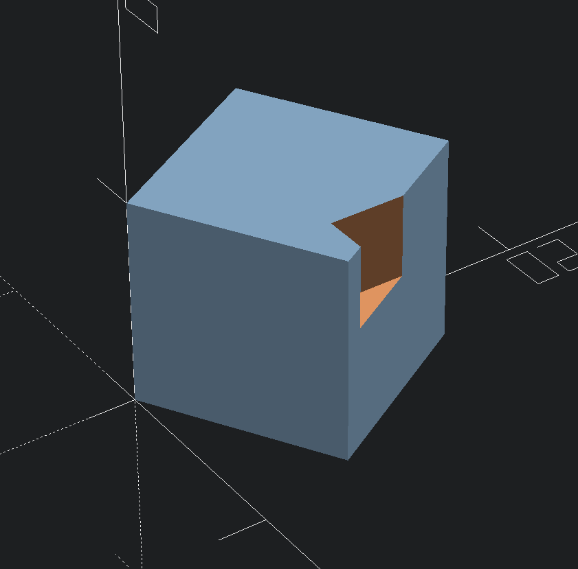

---

## Andre former

Sfære `sphere(r)`

```python
model = sphere(10)
```

2D Polygon `polygon([[x, y, z], ...])`

```python
model = linear_extrude(height=1)(
    polygon([
        [0, 0],
        [0, 1],
        [1, 1],
    ])
)
```

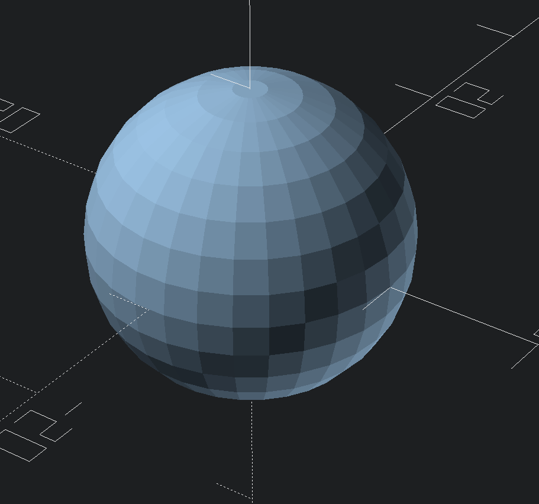
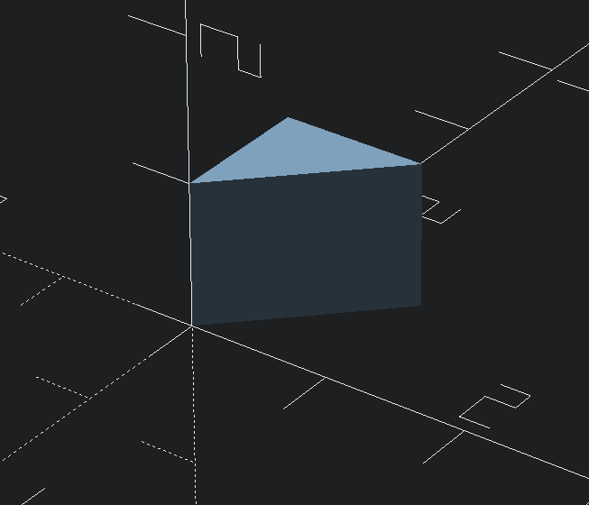

---

## Inkludere andre modeller

Importere modeller `import_stl(file)`

```python
model = import_stl('model.stl')
```

Veldig kjekt for å utvide eksisterende modeller eller bruke dem som avtrykk

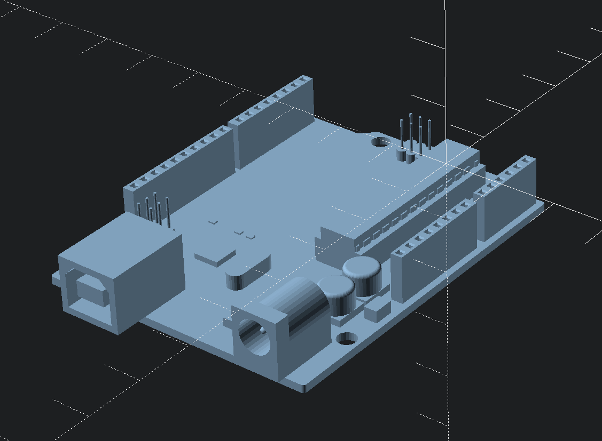

---
<!-- header: '' -->
# Ting man bør tenke ut før man modellerer

---
<!-- header: Ting man bør tenke ut før man modellerer -->
1. Overheng: Kant


---

1. Overheng: Kant

# Løsning:

- Support
- Rotasjon

Igjen, support kan fikses automatisk av 3D-printer software


---

1. Overheng: Kant
2. Overheng: Vinkel


---

1. Overheng: Kant
2. Overheng: Vinkel

# Løsning:

- Support
- Rotasjon
- Dele opp

Support kan fikses automatisk av 3D-printer software


---

# [Slicers](https://www.youtube.com/watch?v=8sxlyuN6xso&ab_channel=Advancedengineeringtechnologies)

---

# [Bruke 3D-scanner!](https://www.youtube.com/watch?v=91HX5gep-I8&ab_channel=AndrewSink)

---

# Hvor kan vi i duppedingsgruppa 3D-printe det vi lager?

- Jeg har en printer og tar mot bestillinger
  - Gratis foreløpig (for Bekkere)
- Vi kan bli medlem av diverse DIY i Trondheim
  - Hackheim (Work Work)
  - Vitensenteret
  - Gløs (MakeNTNU og Omega Verksted)
- Bestille fra nett
- Kjøpe printer selv
- Vente på at vi får tak i printer her 🤞

---

# Spørsmål?
